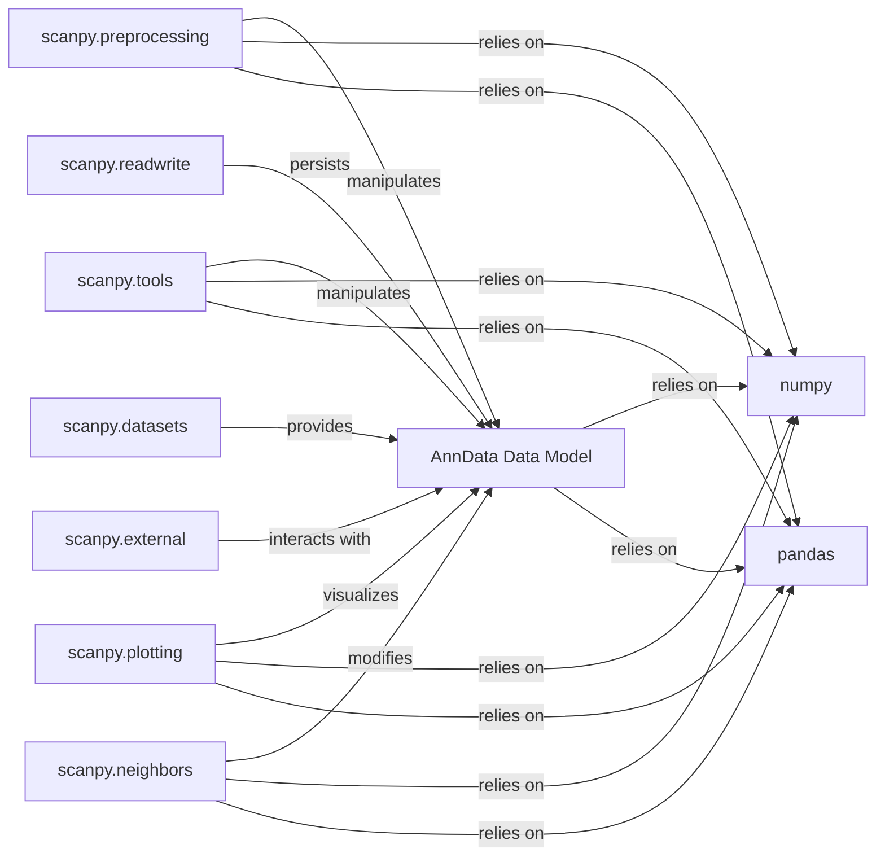

## Details

The `AnnData Data Model` is the cornerstone of the Scanpy ecosystem, serving as the central, in-memory container for all single-cell omics data. Its design as a data-centric architecture means that all other major Scanpy components interact with, manipulate, or visualize data stored within an `AnnData` object. This centralized data structure ensures consistency and facilitates a streamlined workflow for single-cell data analysis.

### AnnData Data Model [[Expand]](./AnnData_Data_Model.md)

The `anndata.AnnData` object is the foundational in-memory data structure that serves as the central repository for all single-cell omics data within Scanpy. It efficiently stores and manages various data modalities, including the primary expression matrix (`.X`), observation annotations (`.obs`), variable annotations (`.var`), unstructured annotations (`.uns`), dimensionality reduction embeddings (`.obsm`), and neighborhood graphs (`.obsp`, `.varp`). It is the primary object manipulated by virtually all other modules and functions within Scanpy, acting as the single source of truth for the dataset throughout the analysis workflow.

**Related Classes/Methods**:

- `anndata` (1:1)

### scanpy.preprocessing

This module contains functions for cleaning, normalizing, and transforming raw single-cell data. Operations include filtering cells and genes, normalization, log-transformation, identification of highly variable genes, and principal component analysis (PCA). These steps prepare the `AnnData` object for downstream analysis.

**Related Classes/Methods**:

- `scanpy.preprocessing` (1:1)

- <a href="https://github.com/scverse/scanpy/blob/main/src/scanpy/preprocessing/_normalization.py#L1-L1" target="_blank" rel="noopener noreferrer">`scanpy.preprocessing._normalization` (1:1)</a>

- <a href="https://github.com/scverse/scanpy/blob/main/src/scanpy/preprocessing/_highly_variable_genes.py#L1-L1" target="_blank" rel="noopener noreferrer">`scanpy.preprocessing._highly_variable_genes` (1:1)</a>

- `scanpy.preprocessing._pca` (1:1)

### scanpy.tools

This module provides the core computational algorithms for single-cell data analysis, such as neighborhood graph construction, dimensionality reduction (e.g., UMAP, t-SNE), clustering (e.g., Leiden, Louvain), and trajectory inference (e.g., PAGA). These tools operate on the preprocessed `AnnData` object and typically add new results (e.g., embeddings, cluster assignments, graph structures) back into the `AnnData` object.

**Related Classes/Methods**:

- `scanpy.tools` (1:1)

- <a href="https://github.com/scverse/scanpy/blob/main/src/scanpy/tools/_umap.py#L1-L1" target="_blank" rel="noopener noreferrer">`scanpy.tools._umap` (1:1)</a>

- <a href="https://github.com/scverse/scanpy/blob/main/src/scanpy/tools/_leiden.py#L1-L1" target="_blank" rel="noopener noreferrer">`scanpy.tools._leiden` (1:1)</a>

- <a href="https://github.com/scverse/scanpy/blob/main/src/scanpy/tools/_paga.py#L1-L1" target="_blank" rel="noopener noreferrer">`scanpy.tools._paga` (1:1)</a>

### scanpy.plotting

This module is dedicated to visualizing single-cell omics data. It provides a wide range of plotting functions to represent expression matrices, cell and gene annotations, dimensionality reduction embeddings, and neighborhood graphs, all sourced directly from the `AnnData` object.

**Related Classes/Methods**:

- `scanpy.plotting` (1:1)

- <a href="https://github.com/scverse/scanpy/blob/main/src/scanpy/plotting/_anndata.py#L1-L1" target="_blank" rel="noopener noreferrer">`scanpy.plotting._anndata` (1:1)</a>

- <a href="https://github.com/scverse/scanpy/blob/main/src/scanpy/plotting/_tools/scatterplots.py#L1-L1" target="_blank" rel="noopener noreferrer">`scanpy.plotting._tools.scatterplots` (1:1)</a>

### scanpy.readwrite

This module handles the input and output of single-cell data, primarily focusing on reading data into an `AnnData` object and writing `AnnData` objects to disk (e.g., H5AD format). It ensures data persistence and interoperability.

**Related Classes/Methods**:

- <a href="https://github.com/scverse/scanpy/blob/main/src/scanpy/readwrite.py#L1-L1" target="_blank" rel="noopener noreferrer">`scanpy.readwrite` (1:1)</a>

### scanpy.datasets

This module provides access to various example single-cell datasets, often pre-packaged as `AnnData` objects. These datasets are useful for tutorials, testing, and demonstrating Scanpy's functionalities.

**Related Classes/Methods**:

- `scanpy.datasets` (1:1)

- <a href="https://github.com/scverse/scanpy/blob/main/src/scanpy/datasets/_datasets.py#L1-L1" target="_blank" rel="noopener noreferrer">`scanpy.datasets._datasets` (1:1)</a>

### scanpy.neighbors

This module is responsible for computing cell-cell neighborhood graphs, which are fundamental for many downstream analyses like clustering, diffusion maps, and trajectory inference. The computed graph is stored within the `AnnData` object.

**Related Classes/Methods**:

- `scanpy.neighbors` (1:1)

- <a href="https://github.com/scverse/scanpy/blob/main/src/scanpy/neighbors/_connectivity.py#L1-L1" target="_blank" rel="noopener noreferrer">`scanpy.neighbors._connectivity` (1:1)</a>

### scanpy.external

This module serves as an integration point for functionalities from other single-cell analysis tools and libraries that can be used within the Scanpy workflow. These external methods often take an `AnnData` object as input and return a modified `AnnData` object or add new results to it.

**Related Classes/Methods**:

- `scanpy.external` (1:1)

- `scanpy.external.pp` (1:1)

- `scanpy.external.tl` (1:1)

### numpy

An external library providing fundamental numerical operations, primarily array objects. `AnnData` heavily relies on NumPy arrays for storing the primary expression matrix (`.X`) and other numerical data.

**Related Classes/Methods**:

- `numpy` (1:1)

### pandas

An external library providing high-performance, easy-to-use data structures (like DataFrames) and data analysis tools. `AnnData` uses Pandas DataFrames for storing observation (`.obs`) and variable (`.var`) annotations.

**Related Classes/Methods**:

- `pandas` (1:1)

### [FAQ](https://github.com/CodeBoarding/GeneratedOnBoardings/tree/main?tab=readme-ov-file#faq)