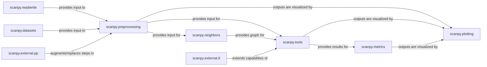

## Details

The Core Analysis Pipeline in Scanpy is designed as a modular and extensible workflow for single-cell omics data analysis. It follows a pipeline pattern, where data flows through distinct stages, each handled by a specialized component. The architecture emphasizes a data-centric approach, with the AnnData object serving as the central data structure passed between components.

### scanpy.readwrite

This component is the entry point for single-cell data into the Scanpy ecosystem. It handles the loading of various data formats (e.g., 10x Genomics, H5AD) into the AnnData object and saving processed data.

**Related Classes/Methods**:

- <a href="https://github.com/scverse/scanpy/blob/main/src/scanpy/readwrite.py" target="_blank" rel="noopener noreferrer">`scanpy.readwrite`</a>

- `scanpy.read_10x`

### scanpy.datasets

Provides access to curated, publicly available single-cell datasets. These datasets are often used for tutorials, examples, and benchmarking, providing standardized input for the pipeline.

**Related Classes/Methods**:

- `scanpy.datasets`

### scanpy.preprocessing

The foundational step for preparing raw single-cell data. It includes essential quality control (filtering cells/genes), normalization, scaling, identification of highly variable genes, and initial dimensionality reduction (e.g., PCA).

**Related Classes/Methods**:

- `scanpy.preprocessing`

- <a href="https://github.com/scverse/scanpy/blob/main/src/scanpy/preprocessing/_combat.py" target="_blank" rel="noopener noreferrer">`scanpy.preprocessing._combat`</a>

- <a href="https://github.com/scverse/scanpy/blob/main/src/scanpy/preprocessing/_highly_variable_genes.py" target="_blank" rel="noopener noreferrer">`scanpy.preprocessing._highly_variable_genes`</a>

- <a href="https://github.com/scverse/scanpy/blob/main/src/scanpy/preprocessing/_normalization.py" target="_blank" rel="noopener noreferrer">`scanpy.preprocessing._normalization`</a>

- <a href="https://github.com/scverse/scanpy/blob/main/src/scanpy/preprocessing/_qc.py" target="_blank" rel="noopener noreferrer">`scanpy.preprocessing._qc`</a>

- <a href="https://github.com/scverse/scanpy/blob/main/src/scanpy/preprocessing/_scale.py" target="_blank" rel="noopener noreferrer">`scanpy.preprocessing._scale`</a>

- <a href="https://github.com/scverse/scanpy/blob/main/src/scanpy/preprocessing/_simple.py" target="_blank" rel="noopener noreferrer">`scanpy.preprocessing._simple`</a>

- `scanpy.preprocessing._pca`

- `scanpy.preprocessing._scrublet`

### scanpy.external.pp

This module serves as an extension point for integrating preprocessing functionalities from other specialized single-cell analysis tools. It allows Scanpy to leverage external algorithms for tasks like batch correction (e.g., Harmony, Scanorama) or advanced imputation (e.g., MAGIC).

**Related Classes/Methods**:

- `scanpy.external.pp`

### scanpy.neighbors

Constructs k-nearest neighbor (KNN) graphs based on the preprocessed data. These graphs mathematically represent the proximity and relationships between individual cells, forming a crucial intermediate step for many graph-based downstream analyses.

**Related Classes/Methods**:

- `scanpy.neighbors`

- <a href="https://github.com/scverse/scanpy/blob/main/src/scanpy/neighbors/_common.py" target="_blank" rel="noopener noreferrer">`scanpy.neighbors._common`</a>

- <a href="https://github.com/scverse/scanpy/blob/main/src/scanpy/neighbors/_backends/rapids.py" target="_blank" rel="noopener noreferrer">`scanpy.neighbors._backends.rapids`</a>

### scanpy.tools

This comprehensive module houses a diverse set of advanced computational tools for single-cell data analysis. Key functionalities include pseudotime inference (DPT), graph abstraction (PAGA), various dimensionality reduction techniques (UMAP, t-SNE), clustering (Louvain, Leiden), differential gene expression analysis, and gene scoring.

**Related Classes/Methods**:

- `scanpy.tools`

- <a href="https://github.com/scverse/scanpy/blob/main/src/scanpy/tools/_dpt.py" target="_blank" rel="noopener noreferrer">`scanpy.tools._dpt`</a>

- <a href="https://github.com/scverse/scanpy/blob/main/src/scanpy/tools/_draw_graph.py" target="_blank" rel="noopener noreferrer">`scanpy.tools._draw_graph`</a>

- <a href="https://github.com/scverse/scanpy/blob/main/src/scanpy/tools/_embedding_density.py" target="_blank" rel="noopener noreferrer">`scanpy.tools._embedding_density`</a>

- <a href="https://github.com/scverse/scanpy/blob/main/src/scanpy/tools/_ingest.py" target="_blank" rel="noopener noreferrer">`scanpy.tools._ingest`</a>

- <a href="https://github.com/scverse/scanpy/blob/main/src/scanpy/tools/_paga.py" target="_blank" rel="noopener noreferrer">`scanpy.tools._paga`</a>

- <a href="https://github.com/scverse/scanpy/blob/main/src/scanpy/tools/_rank_genes_groups.py" target="_blank" rel="noopener noreferrer">`scanpy.tools._rank_genes_groups`</a>

- <a href="https://github.com/scverse/scanpy/blob/main/src/scanpy/tools/_score_genes.py" target="_blank" rel="noopener noreferrer">`scanpy.tools._score_genes`</a>

- <a href="https://github.com/scverse/scanpy/blob/main/src/scanpy/tools/_sim.py" target="_blank" rel="noopener noreferrer">`scanpy.tools._sim`</a>

- <a href="https://github.com/scverse/scanpy/blob/main/src/scanpy/tools/_leiden.py" target="_blank" rel="noopener noreferrer">`scanpy.tools._leiden`</a>

- <a href="https://github.com/scverse/scanpy/blob/main/src/scanpy/tools/_louvain.py" target="_blank" rel="noopener noreferrer">`scanpy.tools._louvain`</a>

- <a href="https://github.com/scverse/scanpy/blob/main/src/scanpy/tools/_tsne.py" target="_blank" rel="noopener noreferrer">`scanpy.tools._tsne`</a>

- <a href="https://github.com/scverse/scanpy/blob/main/src/scanpy/tools/_umap.py" target="_blank" rel="noopener noreferrer">`scanpy.tools._umap`</a>

### scanpy.external.tl

Similar to scanpy.external.pp, this module provides an integration point for advanced analytical tools from external libraries. It extends the core scanpy.tools capabilities with specialized algorithms for tasks not natively implemented in Scanpy.

**Related Classes/Methods**:

- `scanpy.external.tl`

### scanpy.metrics

This module provides functionalities for calculating various quantitative metrics, with a focus on spatial autocorrelation statistics like Moran's I and Geary's C. These metrics are particularly important for analyzing spatial transcriptomics data and understanding spatial patterns of gene expression.

**Related Classes/Methods**:

- `scanpy.metrics`

- <a href="https://github.com/scverse/scanpy/blob/main/src/scanpy/metrics/_common.py" target="_blank" rel="noopener noreferrer">`scanpy.metrics._common`</a>

- <a href="https://github.com/scverse/scanpy/blob/main/src/scanpy/metrics/_gearys_c.py#L105-L106" target="_blank" rel="noopener noreferrer">`scanpy.metrics._gearys_c` (105:106)</a>

- <a href="https://github.com/scverse/scanpy/blob/main/src/scanpy/metrics/_morans_i.py#L103-L104" target="_blank" rel="noopener noreferrer">`scanpy.metrics._morans_i` (103:104)</a>

### scanpy.plotting

Dedicated to the visualization of single-cell data and analysis results. It offers a wide array of plotting functions, ranging from basic scatter plots of embeddings to more complex visualizations like dot plots, matrix plots, and PAGA graphs, crucial for data exploration and communication of findings.

**Related Classes/Methods**:

- `scanpy.plotting`

- <a href="https://github.com/scverse/scanpy/blob/main/src/scanpy/plotting/_anndata.py" target="_blank" rel="noopener noreferrer">`scanpy.plotting._anndata`</a>

- <a href="https://github.com/scverse/scanpy/blob/main/src/scanpy/plotting/_dotplot.py" target="_blank" rel="noopener noreferrer">`scanpy.plotting._dotplot`</a>

- <a href="https://github.com/scverse/scanpy/blob/main/src/scanpy/plotting/_matrixplot.py" target="_blank" rel="noopener noreferrer">`scanpy.plotting._matrixplot`</a>

- <a href="https://github.com/scverse/scanpy/blob/main/src/scanpy/plotting/_tools/paga.py#L301-L656" target="_blank" rel="noopener noreferrer">`scanpy.plotting._tools.paga` (301:656)</a>

- <a href="https://github.com/scverse/scanpy/blob/main/src/scanpy/plotting/_tools/scatterplots.py" target="_blank" rel="noopener noreferrer">`scanpy.plotting._tools.scatterplots`</a>

### [FAQ](https://github.com/CodeBoarding/GeneratedOnBoardings/tree/main?tab=readme-ov-file#faq)