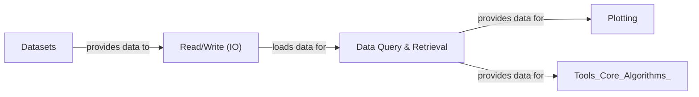

## Details

The `Data Management & Access` subsystem in Scanpy is fundamental to its operation, serving as the gateway for all data interactions. It is composed of three core components: `Read/Write (IO)`, `Datasets`, and `Data Query & Retrieval`. These components are crucial for a scientific computing library, as they enable users to load their experimental data, access curated examples, and efficiently manipulate data within the AnnData object, which is the central data structure in Scanpy.

### Read/Write (IO)

This component is the primary interface for loading and saving single-cell omics data. It supports a wide array of file formats, including the native H5AD format, 10x Genomics output, CSV, TSV, and more. Its robust capabilities ensure seamless data ingress into and egress from the AnnData object, which is central to Scanpy's data model.

**Related Classes/Methods**:

- <a href="https://github.com/scverse/scanpy/blob/main/src/scanpy/readwrite.py" target="_blank" rel="noopener noreferrer">`scanpy.readwrite`</a>

- `scanpy.read_10x`

- `scanpy.read_csv`

- `scanpy.read_h5ad`

- `scanpy.read_loom`

- `scanpy.read_mtx`

- `scanpy.read_text`

- `scanpy.read_umi`

- `scanpy.write`

### Datasets

This component provides convenient access to a collection of pre-curated, example, and reference single-cell datasets. These datasets are invaluable for new users learning Scanpy, for developers testing new features, for benchmarking algorithms, and for reproducing published analyses. They serve as readily available, standardized data sources.

**Related Classes/Methods**:

- `scanpy.datasets`

- <a href="https://github.com/scverse/scanpy/blob/main/src/scanpy/datasets/_datasets.py" target="_blank" rel="noopener noreferrer">`scanpy.datasets._datasets`</a>

### Data Query & Retrieval

This component offers a set of utilities for programmatic access, querying, and retrieving specific subsets or aggregated views of data from an already loaded AnnData object. This includes functions to extract gene expression values, metadata, embeddings, or other computed results based on various criteria, enabling flexible data exploration and downstream analysis.

**Related Classes/Methods**:

- `scanpy.get`

- `scanpy.queries`

### [FAQ](https://github.com/CodeBoarding/GeneratedOnBoardings/tree/main?tab=readme-ov-file#faq)