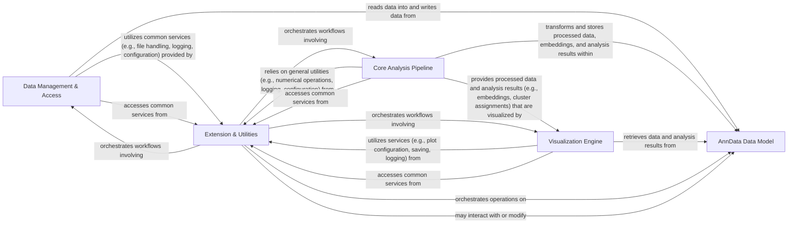

## Details

The `scanpy` architecture is designed as a modular, data-centric scientific computing library, with the `AnnData Data Model` at its core. This model serves as the central hub for all single-cell omics data, around which specialized modules for data handling, analysis, and visualization operate. A dedicated `Extension & Utilities` layer provides cross-cutting concerns and extensibility.

### AnnData Data Model [[Expand]](./AnnData_Data_Model.md)

The foundational in-memory data structure (anndata.AnnData) that serves as the central repository for all single-cell omics data, including expression matrices, cell and gene annotations, dimensionality reduction embeddings, and neighborhood graphs. It is the primary object manipulated by all other modules.

**Related Classes/Methods**:

- `anndata.AnnData`

### Data Management & Access [[Expand]](./Data_Management_Access.md)

Manages all data input/output operations, including reading from and writing to various file formats (e.g., H5AD, 10x Genomics). It also provides access to curated example datasets and utilities for querying and retrieving specific data subsets from the AnnData object.

**Related Classes/Methods**:

- <a href="https://github.com/scverse/scanpy/blob/main/src/scanpy/readwrite.py" target="_blank" rel="noopener noreferrer">`scanpy.readwrite`</a>

- `scanpy.datasets`

- `scanpy.get`

- `scanpy.queries`

### Core Analysis Pipeline [[Expand]](./Core_Analysis_Pipeline.md)

A comprehensive suite of modules responsible for the entire single-cell data analysis workflow. This includes preprocessing (quality control, normalization, scaling, PCA), constructing neighborhood graphs, performing dimensionality reduction (UMAP, t-SNE), clustering, trajectory inference, differential expression analysis, gene scoring, and spatial metrics calculation.

**Related Classes/Methods**:

- `scanpy.preprocessing`

- `scanpy.neighbors`

- `scanpy.tools`

- `scanpy.metrics`

### Visualization Engine

Provides a robust framework and specific functions for generating a wide array of plots to visualize single-cell data and analysis results. This includes core utilities for plot setup, handling common parameters, and high-level functions for scatter plots, heatmaps, dot plots, and specialized trajectory visualizations.

**Related Classes/Methods**:

- `scanpy.plotting`

### Extension & Utilities

A foundational layer providing cross-cutting concerns and extensibility. It includes interfaces for integrating external single-cell analysis tools, a command-line interface for workflow automation, and internal system utilities for configuration management, logging, and general helper functions used across the library.

**Related Classes/Methods**:

- `scanpy.external`

- <a href="https://github.com/scverse/scanpy/blob/main/src/scanpy/cli.py" target="_blank" rel="noopener noreferrer">`scanpy.cli`</a>

- `scanpy._settings`

- <a href="https://github.com/scverse/scanpy/blob/main/src/scanpy/logging.py" target="_blank" rel="noopener noreferrer">`scanpy.logging`</a>

- `scanpy._utils`

### [FAQ](https://github.com/CodeBoarding/GeneratedOnBoardings/tree/main?tab=readme-ov-file#faq)