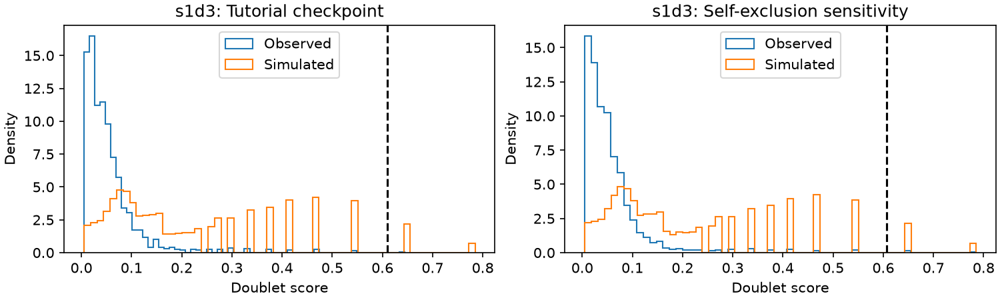

# Scrublet scientific audit

The default Scrublet path contains a confirmed neighbor-count bug. Its automatic threshold also shows strong sensitivity to histogram binning. A controlled self-exclusion correction changes 31 observed calls. A separate histogram sensitivity changes `s1d3` calls from 6 to 165. Neither sensitivity establishes which cells are biological doublets.

## Scope and reproduction

The audited source baseline is `a6f1a2d2`. Tutorial cell 18 calls `sc.pp.scrublet(adata, batch_key="sample")`. Checkpoints `02.h5ad` and `03.h5ad` contain 17,041 cells and 23,427 genes. The original execution took 58.22 seconds.

The [audit script](../../scripts/tutorial_audit/check_03.py) reads both checkpoints and reruns the complete Scrublet stage with instrumentation. All observed scores and calls match exactly. Simulated scores and parent assignments also match. The [evidence](evidence/03.json) records checkpoint hashes, package versions, and the rerun revision. Relevant production source matches the baseline.

```sh
NUMBA_NUM_THREADS=8 OPENBLAS_NUM_THREADS=8 /tmp/scanpy-de-audit-env/bin/python scripts/tutorial_audit/check_03.py --output /home/fdr/scanpy-tutorial-audit > /home/fdr/scanpy-tutorial-audit/logs/03-check.log 2>&1
/tmp/scanpy-audit-tools/bin/ruff check scripts/tutorial_audit/check_03.py
/tmp/scanpy-audit-tools/bin/ruff format --check scripts/tutorial_audit/check_03.py
```

Captured neighbor indices, distances, manifolds, scores, and errors reside in `/home/fdr/scanpy-tutorial-audit/metrics/03-<sample>-neighbor-audit.npz`. Sensitivity plots reside in `/home/fdr/scanpy-tutorial-audit/plots/03-<sample>-sensitivity.png`. The script writes no checkpoint. This audit changes no production code or unit tests.

## Input, simulation, and representation

Input counts are finite, nonnegative integers. Checkpoint 03 preserves the count matrix, cell order, gene order, variable metadata, and existing observation metadata except filter statistics. The wrapper refreshes `n_genes` for 5,927 cells after per-sample gene filtering. This column therefore differs from the earlier global filter statistic. All cells retain scores and calls in their original positions.

The [wrapper](../../src/scanpy/preprocessing/_scrublet/__init__.py) processes each sample independently:

1. Retain genes expressed in at least three cells, then cells with at least three retained genes.
2. Preserve raw counts, normalize observed totals, and select highly variable genes from a separate log-transformed layer.
3. Sum pairs of raw transcriptomes on the selected genes to simulate twice as many doublets as observed cells.
4. Normalize observed and simulated totals to one million on the selected genes.
5. Standardize both matrices with observed gene means and sample standard deviations.
6. Fit 30 PCs on observed cells and project both matrices into that fit.

| Measurement | `s1d1` | `s1d3` |
|---|---:|---:|
| Observed cells, all retained | 8,713 | 8,328 |
| Genes after minimum-cell filter | 21,675 | 21,398 |
| Highly variable genes | 3,680 | 3,551 |
| Simulated doublets | 17,426 | 16,656 |
| Pairs with the same parent twice | 2 | 4 |

The default HVG method uses Seurat-style normalized dispersion, with 20 mean bins and default mean/dispersion cutoffs. This is gene selection, not a hypothesis test. The log layer serves HVG selection only. Default `log_transform=False` leaves the final PCA input on the normalized linear scale before standardization.

Independent checks reproduce every simulated raw count as its parent sum. Parent indices refer to the local sample. Ordered parent pairs are unique, but the [sampler](../../src/scanpy/preprocessing/_utils.py) permits self-pairs and reversed pairs. The six self-pairs are observed simulation outcomes, not evidence of six real doublets.

Independent dense standardization differs by at most `1.60e-13`. Direct PCA projections differ by at most `1.42e-14`. The [PCA implementation](../../src/scanpy/preprocessing/_scrublet/pipeline.py) fits observed cells only, with ARPACK. Simulated cells do not determine the PCA axes. The tutorial's omitted RNG argument selects legacy seed 0 through the [RNG decorator](../../src/scanpy/_utils/random.py).

## Score and error arithmetic

Let `d` denote simulated neighbors, `N` the neighborhood size, `r=2` the simulation ratio, and `rho=0.05` the expected doublet rate. The independent calculation uses odds:

```text
q = (d + 1) / (N + 2)
odds = (d + 1)/(N - d + 1) * rho/(r * (1 - rho))
L = odds/(1 + odds)
SE(q) = sqrt(q*(1-q)/(N+3))
SE(L) = L*(1-L) * sqrt((SE(q)/(q*(1-q)))^2 + (0.02/(rho*(1-rho)))^2)
```

This is algebraically equivalent to the [core formulas](../../src/scanpy/preprocessing/_scrublet/core.py). Maximum absolute errors are `1.34e-15` for scores and `6.67e-16` for score errors. The arithmetic is correct for the supplied counts. The next section identifies incorrect neighborhood membership.

The [primary paper](https://pmc.ncbi.nlm.nih.gov/articles/PMC6625319/) derives the score and delta-method error under model assumptions. The supplied 5% rate is a prior, not a measured tutorial result. Its 2-percentage-point standard deviation also comes from the default. Score errors do not include uncertainty from PCA, gene selection, approximate search, or threshold choice. They are not empirical false-discovery rates.

## Confirmed self-neighbor bug

The default base neighbor counts are 47 and 46. Multiplication by `1+r` gives `N=141` and `N=138`. Both samples use PyNNDescent.

Actual sparse rows contain `N+1` entries, including exactly one self entry. The [extractor](../../src/scanpy/neighbors/_common.py) truncates them to `N` entries. Every extracted row still contains self. The [classifier](../../src/scanpy/preprocessing/_scrublet/core.py) removes the first column only when `use_approx_neighbors` is truthy. The tutorial uses `None`, so each observed cell contributes a known observed vote to its own classification. Each simulated cell contributes a known simulated vote.

One `s1d1` row and two `s1d3` rows place self outside the first column because of ties. Thus removing column zero also fails to exclude self consistently.

The controlled sensitivity removes self by row identity and retains all `N` nonself entries from the same stored graph. It preserves PCA, simulated parents, distances, `N`, prior, and random realization. It neither rebuilds the graph nor changes the original checkpoint.

| Measurement | `s1d1` | `s1d3` |
|---|---:|---:|
| Observed scores that increase | 5,167 | 5,118 |
| Mean observed score increase | 0.001863 | 0.002377 |
| Maximum observed score increase | 0.139119 | 0.140451 |
| Original threshold | 0.223405 | 0.610139 |
| Recomputed corrected threshold | 0.226295 | 0.607092 |
| Original doublet calls | 207 | 6 |
| Corrected doublet calls | 224 | 20 |
| Changed calls, original threshold | 17 | 14 |
| Changed calls, corrected threshold | 17 | 14 |

No calls change from doublet to singlet. The evidence lists all 31 changed cell names by sample. The direction is deterministic: replacing an observed self vote can only increase an observed simulated-neighbor count. This is score bias relative to the specified nonself estimator, not measured bias against biological truth.

Setting `use_approx_neighbors=True` is not a complete correction. It leaves only `N-1` entries but still uses `N` in the score formula. It also retains self in the three tied rows. The audit replays the actual classifier on the captured graph for both this branch and the controlled correction. Both agree with independent formulas.

The [upstream helper at commit 67f8ecb](https://github.com/swolock/scrublet/blob/67f8ecbad14e8e1aa9c89b43dac6638cebe38640/src/scrublet/helper_functions.py#L344) requests `k+1` Annoy neighbors and removes the first. Its exact path calls `kneighbors` without query data, which excludes training self. The [upstream classifier](https://github.com/swolock/scrublet/blob/67f8ecbad14e8e1aa9c89b43dac6638cebe38640/src/scrublet/scrublet.py#L323) uses `k` as the denominator. Upstream agreement supports intended neighborhood size, but does not prove statistical calibration or solve identity ties.

History attributes the self-removal branch to `7449672e` (2024-03-14). Commit `c26480ed` (2024-05-14) changed the default to `None` while retaining the truthiness condition. Historical extraction also truncates to the requested size.
The same condition and extraction behavior remain in the [1.12.4 source](https://github.com/scverse/scanpy/blob/1.12.4/src/scanpy/preprocessing/_scrublet/core.py). This audit did not rerun historical environments, so all numerical impacts refer to baseline `a6f1a2d2`.

A secondary exact search evaluates 128 deterministic observed queries per sample against every observed and simulated cell. It excludes self by identity. Mean neighbor recall against this exact search is 99.989% and 99.994% for the corrected graph. No sampled calls change at the original threshold, but score differences reach 0.05693 and 0.04522. This smaller comparison combines approximation error and self treatment. It does not replace the full-graph controlled comparison.

## Automatic thresholds need review

Saved assignments exactly equal `doublet_score > threshold`. The installed `threshold_minimum` reproduces both saved thresholds. It repeatedly smooths a 256-bin histogram until two maxima remain, then selects the minimum between them. This is a histogram heuristic, not a significance cutoff.

The inspected histograms show discrete simulated-score spikes. For `s1d3`, the automatic cutoff sits above most of the broad higher-score population. Its location is sensitive to histogram resolution:

| Histogram bins | `s1d1` threshold / calls | `s1d3` threshold / calls |
|---|---:|---:|
| 64 | 0.218808 / 227 | 0.267411 / 165 |
| 128 | 0.221872 / 227 | 0.605569 / 6 |
| 256, tutorial | 0.223405 / 207 | 0.610139 / 6 |
| 512 | 0.222639 / 227 | 0.607854 / 6 |



The figure shows the separate self-exclusion comparison.
The histogram-bin sensitivity in the table holds every score fixed. It is separate from the self-neighbor correction. The 64-bin result is not a validated replacement threshold.

Detected fractions are 2.376% and 0.072%. Simulated detectable fractions are 32.24% and 3.72%. Their ratios imply overall rates of 7.37% and 1.94%, compared with the supplied 5%. These differences warrant review of the threshold and model assumptions. They do not identify the correct prior.

The [paper](https://pmc.ncbi.nlm.nih.gov/articles/PMC6625319/) assumes rare multiplets and representation of contributing parent states among singlets. Embedded doublets can remain indistinguishable from singlets. Separate sample analysis avoids impossible cross-sample pairs, but does not establish these assumptions. This audit contains no independent doublet labels and cannot estimate biological precision or recall. The tutorial retains every cell at this stage and only adds predictions.
