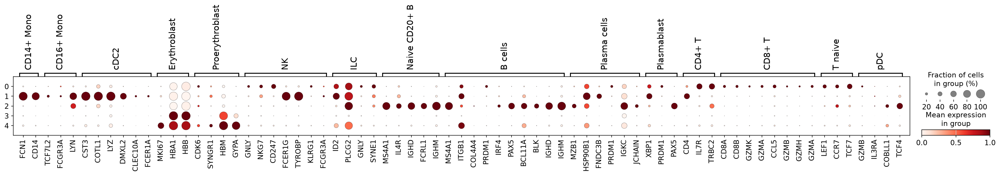

# Scientific audit of the standard Scanpy tutorial

Two confirmed failures occur in the executed tutorial: incorrect Scrublet neighbor handling and a nonportable cell-type annotation map.
The independent checks found no numerical implementation failure in the executed normalization, HVG, PCA, Leiden, or DGE calculations.
The neighbor graph also matches its stated fuzzy-membership formula.
These results apply to the recorded paths and dataset, not every Scanpy function or release.

The audit runs the original tutorial in ten stages on its full public dataset.
Basic filters retain 17,041 cells and 23,427 genes from two samples.
Seven dedicated Codex executors worked in visible Herdr panes, with supervisor review before acceptance.
All seven reviews are complete, and their executor panes are closed.
The source baseline is `a6f1a2d23496e97a01860029f7bd57b0bcce6e27` (`1.14.0.dev6`).

## Confirmed failures

| Failure | Measured example and consequence |
| --- | --- |
| **Scrublet counts self under the default `use_approx_neighbors=None`.** | Removing self by identity while preserving the graph and neighbor count increases 10,285 observed scores. Calls change from **213 to 244**, with 31 gains and no losses. The largest score increase is **0.140451**. |
| **The tutorial maps fixed cluster numbers to cell types.** | It labels **2,269 B-marker-enriched cells as Erythroid** and **1,759 erythroid-marker-enriched cells as B Cells**. A fifth cluster leaves **1,743 cells unannotated**. The code completes without an error. |

The [Scrublet review](03-scrublet.md) isolates self handling from simulation, PCA, and approximate-search variation.
The 31 changed calls represent 0.18% of all cells and a 14.55% increase in predicted doublets.
Setting `use_approx_neighbors=True` is not a complete correction: it leaves too few entries for the formula denominator and retains self in three tied rows.
No independent doublet labels are available, so these differences do not establish biological precision or recall.

The [annotation review](08-clustering.md) checks marker means and expression fractions independently.
The same fixed map appears in the [published stable tutorial](https://scanpy.readthedocs.io/en/stable/tutorials/basics/clustering.html), checked on 2026-09-10.
The failure counts come from our recorded development checkout and environment.
They do not establish how many published studies used incorrect labels.

The original plot shows B-cell enrichment in row 2 and erythroid enrichment in rows 3 and 4.
These markers support broad interpretations, not complete biological ground truth.

Neither failure changes the expression matrix used for DGE in this notebook.
The tutorial retains predicted doublets, and DGE uses `leiden_res_0.50` rather than the incorrect annotation column.
Users who filter on doublet predictions or interpret the fixed labels can obtain different downstream results.

## Results by scientific step

| Step | Independent result |
| --- | --- |
| [03: Scrublet](03-scrublet.md) | Full instrumented replay matches saved scores, calls, and simulations exactly. Score arithmetic agrees within `1.34e-15`, but neighborhood membership is incorrect. |
| [04: Normalization](04-normalization.md) | All **26,539,065 nonzero values** agree within float32 accuracy. Counts and zeros are preserved. |
| [05: Highly variable genes](05-hvg.md) | All **2,000 selected genes** agree, including sample flags and batch counts. Maximum normalized-dispersion error: `4.316e-7`. |
| [06: PCA](06-pca.md) | All scores and loadings pass. Independent eigenvalues agree within `1.88e-6` relative error. Fifty PCs retain **61.03%** of selected-gene variance. |
| [07: Neighbors and UMAP](07-umap.md) | Full fuzzy-graph support agrees exactly, with maximum weight error `3.55e-6`. Exact-neighbor recall is **98.40%** on 1,024 deterministic query cells against all cells. |
| [08–09: Leiden and annotation](08-clustering.md) | All four saved partitions match direct igraph exactly. Independent objective error is at most `3.4e-16`. The fixed annotation map fails. |
| [10: Differential expression](10-dge.md) | All **398,259 gene/group comparisons** pass. Default p-values match exactly, and maximum BH error is `2.221e-16`. Both original plots complete. |

These checks establish numerical agreement within their stated scope.
They do not establish optimal model choices or biological calibration.
The UMAP review reconstructs the graph and measures embedding quality; it does not independently reimplement the entire optimizer.

## Scientific sensitivities and limits

- **Automatic doublet thresholds:** with scores fixed, changing histogram bins from 256 to 64 changes `s1d3` calls from **6 to 165**. This is separate from the self-neighbor bug. The alternative threshold is not validated biological truth.
- **DGE ties:** enabling tie correction changes gene/group pairs with adjusted p < 0.05 from **80,557 to 165,700**. The default calculation correctly implements its stated approximation.
- **Fold-change definition:** geometric-style versus arithmetic fold changes reverse 25,882 signs. Only **four** reversals exceed one log2 unit in both definitions and pass the default adjusted-p threshold. The DGE report gives the actual genes and means.
- **HVG selection:** only 628 selected genes qualify in both samples. Although 184 selected genes occur in at most ten cells, they contribute only **0.000670%** of retained PCA variance.
- **UMAP interpretation:** the embedding retains **14.95%** of exact neighbors for the sampled queries, despite trustworthiness **0.95937**. The original graph is connected. Leiden uses that graph, not the two-dimensional coordinates.
- **QC and composition:** all 213 predicted doublets remain. One small cluster contains 23/61 predicted doublets. The strongest mitochondrial association is PC5, outside the tutorial's PC1–PC4 scatter plots. These observations need biological review and do not prove technical causes.

Cluster-derived DGE uses the same expression data for cluster selection and marker testing.
Its per-cell p-values do not establish population-level treatment or disease effects.
The marker profile of resolution-0.5 cluster 7 supports the tutorial's tentative NK interpretation in this run.

A separate documentation mismatch affects stored distances: rows contain 15 nonself entries, while the documented count is 14.
Fuzzy memberships correctly use 14. No corresponding fuzzy-graph calculation failure appears here.

## Evidence and reproduction

- [Execution stages and reproduction](README.md)
- [Original records for all ten stages](evidence/execution.json)
- [Source and dataset provenance](evidence/provenance.json)
- [Pinned package environment](evidence/environment.txt)
- [Executor review record](evidence/executors.json)

The runner executes original notebook cells and preserves their scientific parameters and default random seeds.
It uses a noninteractive plot backend and eight workers, and saves checkpoints and plots after each stage.
Each detailed report includes its source review, independent audit script, commands, numerical evidence, and limits.
Data import and basic QC are preparation, outside the scientific audit.
No production Scanpy code or original notebook changes form part of this report.

Large artifacts remain in `/home/fdr/scanpy-tutorial-audit`.
The dataset DOI is [10.6084/m9.figshare.22716739.v1](https://doi.org/10.6084/m9.figshare.22716739.v1).
The source notebook is [clustering.ipynb](../../docs/tutorials/basics/clustering.ipynb).
