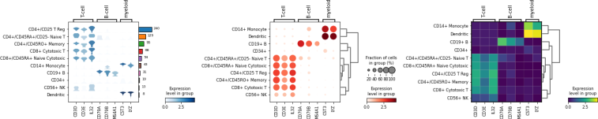
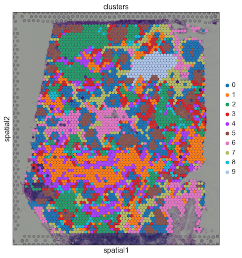

Tutorials
=========

Clustering
----------

For getting started, we recommend Scanpy’s reimplementation :tutorial:`pbmc3k`
of Seurat’s [Satija15]_ clustering tutorial for 3k PBMCs from 10x Genomics,
containing preprocessing, clustering and the identification of cell types via
known marker genes.

.. image:: http://falexwolf.de/img/scanpy_usage/170505_seurat/filter_genes_dispersion.png
   :width: 100px
.. image:: http://falexwolf.de/img/scanpy_usage/170505_seurat/louvain.png
   :width: 100px
.. image:: http://falexwolf.de/img/scanpy_usage/170505_seurat/NKG7.png
   :width: 100px
.. image:: http://falexwolf.de/img/scanpy_usage/170505_seurat/violin.png
   :width: 100px
.. image:: http://falexwolf.de/img/scanpy_usage/170505_seurat/cell_types.png
   :width: 200px

Visualization
-------------

This tutorial shows how to visually explore genes using scanpy. :tutorial:`plotting/core`

Trajectory inference
--------------------

Get started with the following example for hematopoiesis for data of [Paul15]_: :tutorial:`paga-paul15`

.. image:: http://www.falexwolf.de/img/paga_paul15.png
   :width: 450px

More examples for trajectory inference on complex datasets can be found in the
`PAGA <https://github.com/theislab/paga>`_ repository [Wolf19]_, for instance, multi-resolution analyses of whole
animals, such as for planaria_ for data of [Plass18]_.

.. image:: http://www.falexwolf.de/img/paga_planaria.png
   :width: 350px

As a reference for simple pseudotime analyses, we provide the diffusion pseudotime (DPT) analyses of [Haghverdi16]_
for two hematopoiesis datasets: `DPT example 1`_ [Paul15]_ and `DPT example 2`_ [Moignard15]_.

.. _planaria: https://nbviewer.jupyter.org/github/theislab/paga/blob/master/planaria/planaria.ipynb
.. _DPT example 1: https://nbviewer.jupyter.org/github/theislab/scanpy_usage/blob/master/170502_paul15/paul15.ipynb
.. _DPT example 2: https://nbviewer.jupyter.org/github/theislab/scanpy_usage/blob/master/170501_moignard15/moignard15.ipynb

Integrating datasets
--------------------

Map labels and embeddings of reference data to new data: :tutorial:`integrating-data-using-ingest`

.. image:: https://scanpy-tutorials.readthedocs.io/en/latest/_images/integrating-data-using-ingest_21_0.png
   :width: 350px

Spatial data
------------

* Basic analysis of spatial data: :tutorial:`spatial/basic-analysis`
* Integrating spatial data with scRNA-seq using scanorama: :tutorial:`spatial/integration-scanorama`

Further Tutorials
-----------------

.. _conversion_to_r:

Conversion: AnnData, SingleCellExperiment, and Seurat objects
~~~~~~~~~~~~~~~~~~~~~~~~~~~~~~~~~~~~~~~~~~~~~~~~~~~~~~~~~~~~~

.. image:: https://github.com/theislab/scanpy-in-R/raw/master/logo.png
   :width: 200px
   :align: right

* See `Seurat to AnnData`_ for a tutorial on `anndata2ri`.
* See the `Scanpy in R`_ guide for a tutorial on interacting with Scanpy from R.

.. _Seurat to AnnData: https://github.com/LuckyMD/Code_snippets/blob/master/Seurat_to_anndata.ipynb
.. _Scanpy in R: https://theislab.github.io/scanpy-in-R/

Regressing out cell cycle
~~~~~~~~~~~~~~~~~~~~~~~~~

See the `cell cycle`_ notebook.

.. _cell cycle: https://nbviewer.jupyter.org/github/theislab/scanpy_usage/blob/master/180209_cell_cycle/cell_cycle.ipynb

.. image:: http://falexwolf.de/img/scanpy_usage/170522_visualizing_one_million_cells/tsne_1.3M.png
   :width: 120px
   :align: right

Scaling Computations
~~~~~~~~~~~~~~~~~~~~

* Visualize and cluster `1.3M neurons`_ from 10x Genomics.

.. _1.3M neurons: https://github.com/theislab/scanpy_usage/tree/master/170522_visualizing_one_million_cells

Simulations
~~~~~~~~~~~

Simulating single cells using literature-curated gene regulatory networks [Wittmann09]_.

.. image:: http://falexwolf.de/img/scanpy_usage/170430_krumsiek11/timeseries.png
   :width: 200px
   :align: right

* Notebook for `myeloid differentiation`_
* Notebook for simple toggleswitch_

.. _myeloid differentiation: https://nbviewer.jupyter.org/github/theislab/scanpy_usage/blob/master/170430_krumsiek11/krumsiek11.ipynb
.. _toggleswitch: https://nbviewer.jupyter.org/github/theislab/scanpy_usage/blob/master/170430_krumsiek11/toggleswitch.ipynb

Images
~~~~~~

See pseudotime-time inference on deep-learning based features for `cell cycle reconstruction`_ from image data [Eulenberg17]_.

.. _cell cycle reconstruction: https://github.com/theislab/scanpy_usage/tree/master/170529_images

..
    User Examples
    ~~~~~~~~~~~~~

    January 12, 2018: `Exploring the mouse cell atlas`_ by `David P. Cook`_.
    Data by `Tabula Muris Consortium`_.

    .. _Exploring the mouse cell atlas: https://github.com/dpcook/fun_analysis/blob/master/tabula_muris/mouse_atlas_scanpy.ipynb
    .. _David P. Cook: https://twitter.com/DavidPCook
    .. _Tabula Muris Consortium: https://www.biorxiv.org/content/early/2017/12/20/237446
